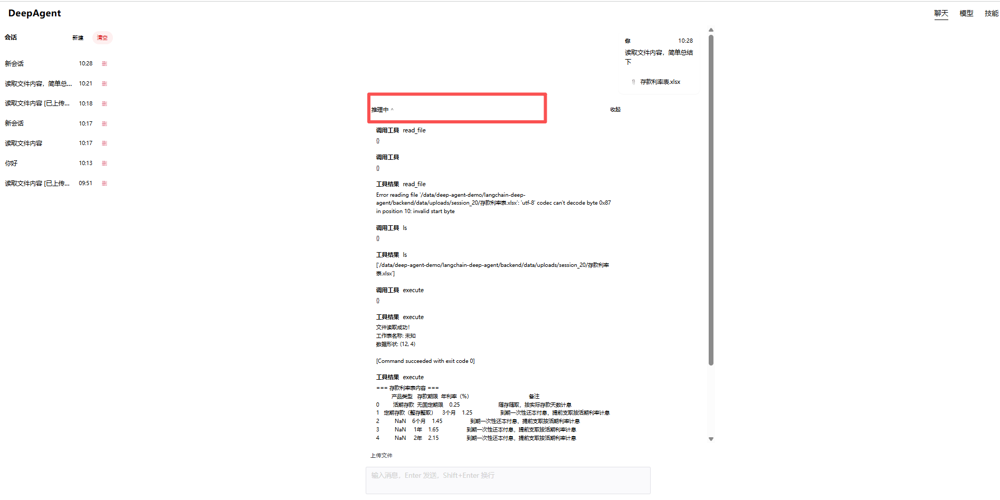
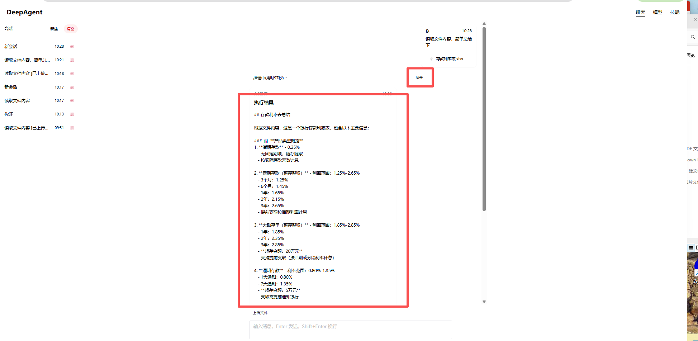
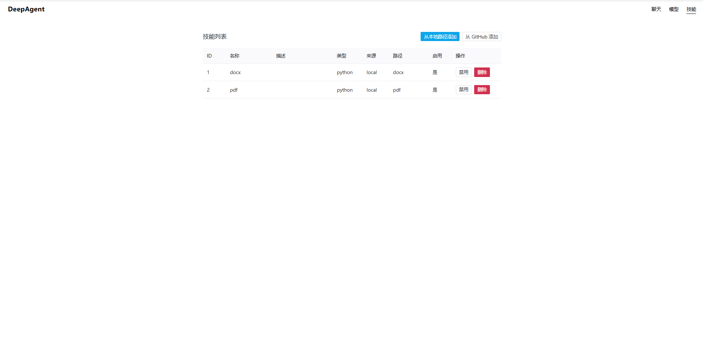

# DeepAgent Demo

Vue 3 + FastAPI + SQLite + DeepAgents 的聊天 Agent 应用。

## 项目结构

- **backend/**：FastAPI + SQLite，DeepAgents（任务规划、文件系统、长期记忆、技能）
- **frontend/**：Vue 3 + Vite + Naive UI
- **docs/**：需求与设计文档

## 快速开始

**后端**

```bash
cd backend
pip install -r requirements.txt
python run_dev.py
```

> `run_dev.py` 会以 `--reload` 启动，并排除 `skills/` 目录，避免「从本地路径添加」技能时因文件复制触发的自动重启。  
> 若用命令行直接启动，PowerShell 可能展开通配符，请用：`uvicorn main:app --reload --reload-exclude=skills/*`

**前端**

```bash
cd frontend
npm install
npm run dev
```

浏览器访问前端地址（如 `http://localhost:5173`），前端会把 `/api` 代理到后端 `http://127.0.0.1:8000`。




## 环境变量（可选）

在 `backend/` 下可建 `.env`，常用：

- `DEEPSEEK_API_KEY`：DeepSeek 密钥（默认用 deepseek-chat）
- `APP_DEBUG=1`：开启调试日志与 LangSmith
- `DATABASE_URL`：默认 `sqlite:///./data/agent_app.db`

## 功能概览

- **聊天**：新建会话、发送消息、流式回复、推理过程展示；支持上传文件
- **模型**：查看/修改默认模型，测试连接
- **技能**：列表、启用/禁用；从本地 `backend/skills/` 或 GitHub 添加，详见 [docs/SKILLS.md](docs/SKILLS.md)
